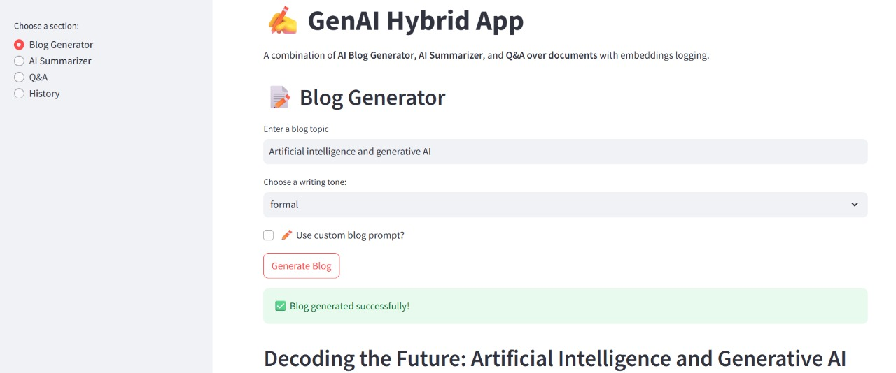
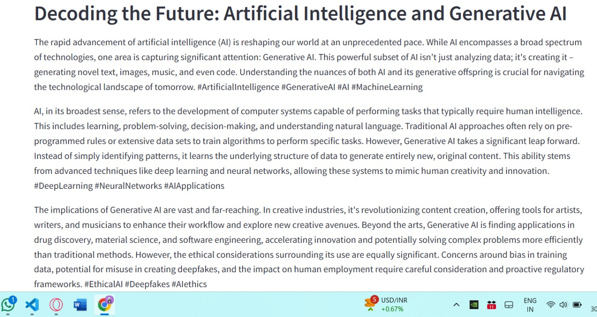
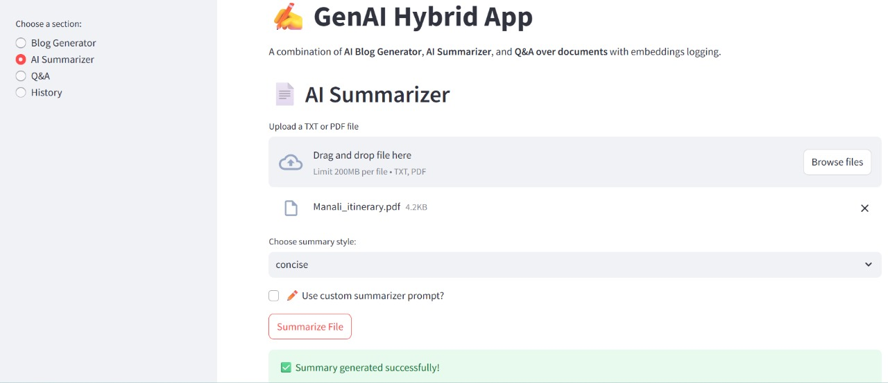
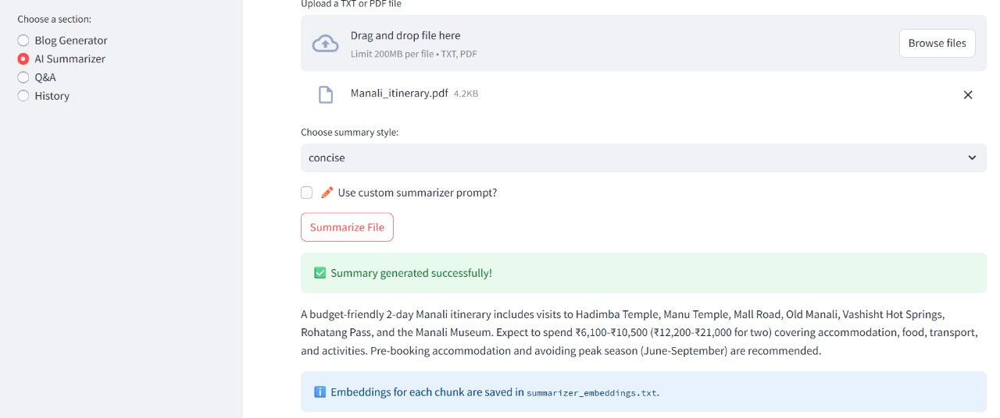
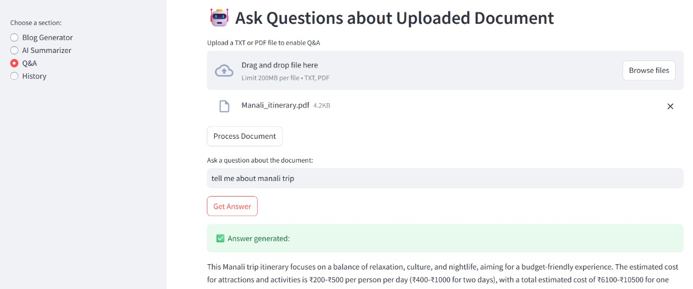
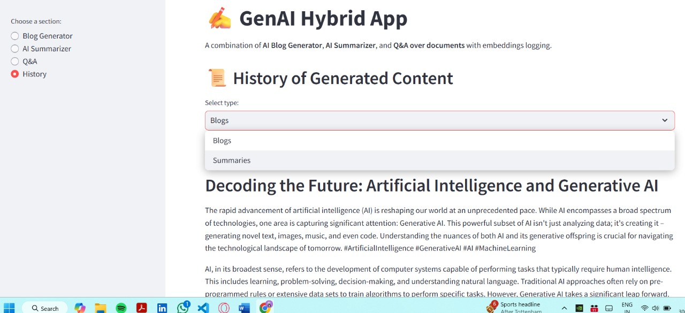
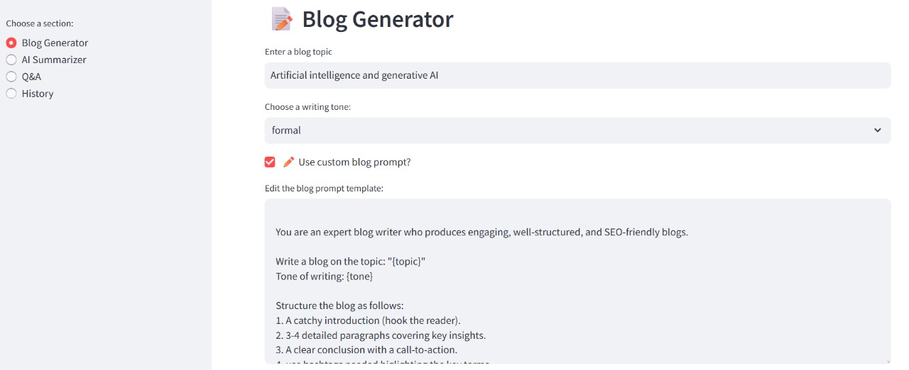

# ✨ GenAI Hybrid App

🚀 A full-fledged **Generative AI application** that combines:

- 📝 **Blog Generator** (with customizable tones)
- 📄 **AI Summarizer** (with RAG & embeddings logging)
- 🤖 **Q&A over documents** (retrieval-augmented generation)
- 📜 **History & Version Control** (blogs, summaries, embeddings with timestamps)
- ⚙️ **Custom Prompt Editor** (prompt engineering playground)

Built with **LangChain, OpenAI/Groq LLMs, and Streamlit** to showcase advanced **Generative AI Engineering** skills.

_"I built a Generative AI hybrid application that combines blog generation, document summarization, and Q&A over documents using a RAG pipeline. It has a Streamlit frontend where users can generate blogs with different tones, summarize uploaded files, and even ask questions about documents through retrieval-augmented generation. I also added history tracking, embeddings logging, and a custom prompt editor to showcase prompt engineering skills. The project demonstrates end-to-end GenAI engineering, including LLM orchestration with LangChain, embeddings with ChromaDB, and frontend integration."_

---

## 🛠️ Tech Stack

### **Frontend**

- [Streamlit](https://streamlit.io/) → Interactive UI with multiple sections, file uploads, and live prompt editing.

### **LLM & GenAI**

- [LangChain](https://www.langchain.com/) → Orchestration framework for LLM, embeddings, and RAG pipelines.
- **LLM** → Configurable (OpenAI GPT, Groq, or other providers).
- **Prompt Engineering** → Editable system prompts for blogs, summaries, and Q&A.

### **Embeddings & Vector Store**

- **Embeddings** → Created for uploaded documents & stored for retrieval.
- [ChromaDB](https://www.trychroma.com/) → Local vector database for document Q&A.

### **File Handling & Persistence**

- JSON storage for **blogs & summaries history** .
- Embeddings logged into `summarizer_embeddings.txt` (for transparency & debugging).

---

## 🚀 Features

### 1️⃣ Blog Generator

- Input a **topic** + choose **tone** (`formal`, `casual`, `marketing`, `academic`).
- Generates **human-like blogs** using LLM.
- Saves each blog in `blogs.json` with timestamp.

### 2️⃣ AI Summarizer

- Upload **PDF or TXT** files.
- Choose summary style: `concise`, `detailed`, or `bullet_points`.
- Automatically generates embeddings for file chunks.
- Stores results in `summaries.json` + embeddings in `summarizer_embeddings.txt`.

### 3️⃣ Q&A over Documents (RAG)

- Upload a **document** → stored in ChromaDB as embeddings.
- Ask **questions about the document** → Answer is generated using **retrieval + LLM** .
- Demonstrates **Retrieval-Augmented Generation** .

### 4️⃣ History & Version Control

- View all **past blogs & summaries** in a structured format.
- Each entry shows **timestamp, tone/style, content, and embeddings reference** .
- Highlights **state management & persistence** (important for production apps).

### 5️⃣ Custom Prompt Editor (Prompt Engineering)

- Built-in **Prompt Editor UI** in Streamlit.
- Edit system prompts for:
  - Blog Generator
  - Summarizer
  - Q&A
- Showcase **prompt engineering mastery** (a must-have GenAI skill).

---

## 📂 Project Structure

```
├── app.py                  # Main Streamlit app
├── modules/
│   ├── blog_generator.py   # Blog generation logic
│   ├── summarizer.py       # File summarization + embeddings
│   ├── rag_qa.py           # Document Q&A with ChromaDB
│   ├── history.py          # JSON-based history persistence
│   ├── prompts.py          # Default system prompts (editable)
│   └── utils.py            # Helper functions
├── blogs.json              # Stores blog history
├── summaries.json          # Stores summaries history
├── summarizer_embeddings.txt # Logs generated embeddings
├── requirements.txt
└── README.md
```

---

## ⚙️ Installation & Setup

1. Clone the repo

```bash
git clone https://github.com/your-username/genai-hybrid-app.git
cd genai-hybrid-app
```

2. Create and activate a virtual environment

```bash
python -m venv venv
source venv/bin/activate   # Mac/Linux
venv\Scripts\activate      # Windows
```

3. Install dependencies

```bash
pip install -r requirements.txt
```

4. Add your API keys in a `.env` file

```
GOOGLE_API_KEY=your_openai_key
# or Groq, Gemini, etc.
```

5. Run the app

```bash
streamlit run app.py
```

---

## 📸 Screenshots

- **Blog Generator UI**

  

  

- **AI Summarizer with styles**

  

  

- **Q&A over documents (RAG)**

  

- **History Viewer**

  

- **Prompt Editor (Prompt Engineering Playground)**

  

---

## 🎯 Why this project is Resume-Worthy?

✅ **End-to-End GenAI System** : Not just a toy project – covers text generation, summarization, RAG, embeddings, and history mgmt.

✅ **Demonstrates RAG** : Employers look for RAG pipeline understanding → you showcase it via Q&A + summarizer.

✅ **Prompt Engineering** : Custom prompt editor UI is a unique highlight.

✅ **Persistence** : JSON + embeddings logging → production-style state management.

✅ **Full-Stack AI Engineering** : Combines LLMs, vector DB, orchestration, and a clean frontend.

✅ **Scalable** : Can easily plug in **any LLM provider** (OpenAI, Groq, Gemini, Anthropic).

---

## 🔮 Future Enhancements

- Support for **multi-file Q&A** (knowledge base).
- Deploy on **Vercel/Streamlit Cloud** .
- Integrate **Pinecone/Weaviate** for scalable embeddings storage.
- Add **user authentication** & personalized history.
- Export blogs/summaries as **PDF/Word files** .

---

## 👨‍💻 Author

Ashutosh Raj Gupta – _AI Engineer | MERN + GenAI Developer_
